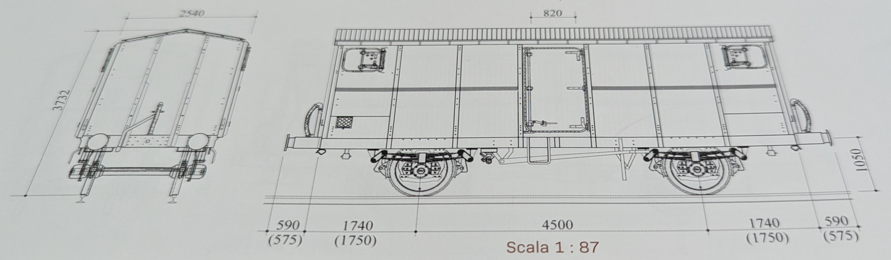
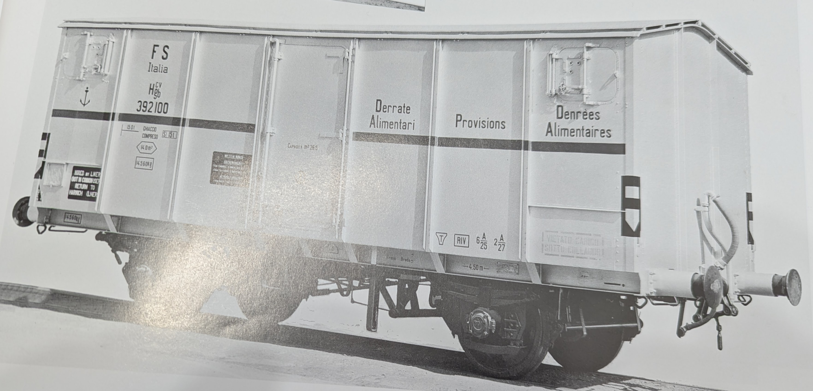
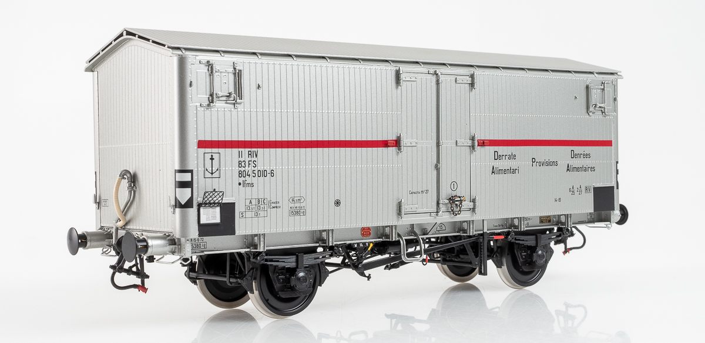

# Vorbild

Kühlwagen mit Kühlboxen englischer Bauart; die Angaben (2) beziehen sich auf die Wagen mit der Nummerierung 392300-392303, die auf Wagenfahrgestelle der Bauart 1931 von Hgb umgebaut wurden.

## Abmessungen

- Wagenhöhe: 3732 mm
- Wagenbreite: 2540 mm
- Achsstand: 4500 mm

## Fahrgestell

- Radsatz Typ NRc, Buchsen Typ RIV/TR191, Tragfedern Typ 554F/2
- Puffer Typ RE5L, Gehäuse Typ CU5L, Ringpufferfedern
- Diskontinuierliche Traktion mit RO-Traktionshaken

## Kasten

- 4 isolierte Türen
- 2 feste Kühlboxen
- 6 bewegliche Bodenroste
- 2 abnehmbare Kühlbox-Schutzwände

## Bremse

- Bremsleitung im englischen Stil
- Handbremse mit Bodenbetätigungsstange

## Sonstiges

- Durchschnittliches Eigengewicht: 14,5 t
- Zuladung: 14 t
- Ladevolumen: 26,5 m³
- Grundfläche: 14 m²
- Geschwindigkeitsklasse: 1
- Metallrahmen
- Isolierter Aufbau
- Außen- und Innenblechverkleidung
- Blechdach
- Holzdachhimmel
- Beweglicher Gitterrost-Unterboden
- Ursprüngliche gebaute Menge: 246
- Wagennummern (gerade Hunderter): 391754 – 392199
- Voraussetzungen: C, V

## Hgb CV 392100

Der in seinen Originalzustand zurückversetzte und mit einer Breda-Automatikbremse mit M.V.-Einrichtung ausgestattete Waggon Hgb CV 392100 befindet sich, wie aus der seitlichen Beschriftung unten rechts hervorgeht, noch in der Erprobungsphase; für den Englandverkehr ist das Fahrzeug zudem bereits mit einer Vakuumbremse ausgerüstet.

